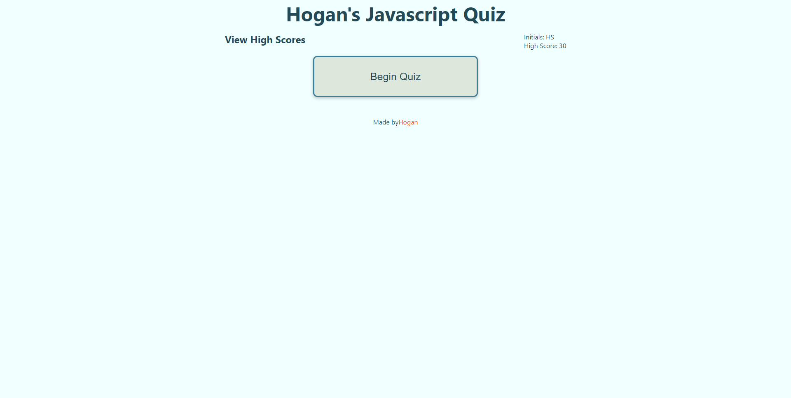

# Hogan's Javascript Quiz

### This Javascript Quiz was created using:
 * HTML
 * CSS
 * Javascript

### Directions:
 1. When ready, click on the ```Begin Quiz``` button.
 2. Input answers to the generated questions in the text box provided.
 3. All answers should be in the format of words (e.g. an answer of ```1``` should be entered as ```one```).

 <hr>
 

 You can access the published page [here](https://hoganrsherrow.github.io/javascript-quiz/), and the repository link can be found [here](https://github.com/hoganrsherrow/javascript-quiz).

